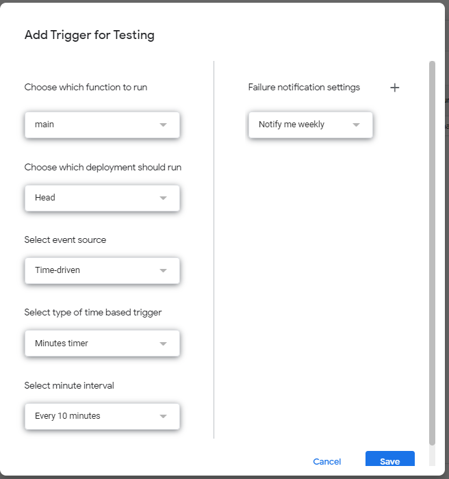

# Google Tasks -> Habitica One-way Sync

Do you like Google Tasks to keep everything in place but also want to level up your character in Habitica? This tool copies all of your Google Tasks to Habitica and checks if any of the GTasks are updated/marked as done and marks the corresponding Habitica todo accordingly.

Limited to 100 tasks per tasklist theoretically, but you'll hit the Google Apps Script runtime limit at that point. Best to limit it at around 50 tasks total (including completed tasks)

## Usage

1. Download the `*.gs` files. 
2. Find your Habitica API User ID and API Token, available at [this page](https://habitica.com/user/settings/api).
3. Upload, or copy and paste, all the files into a [Google Apps Script](https://script.google.com/) project.
4. Add the "Tasks API" service to the Apps Script project.
    * From within the project, select the "Services" + then scroll down and add the "Tasks API" service.

5. Go to "Project Settings" (gear icon at the right) and populate the "Script Properties" as follows:
   * `habitica_apikey`, `habitica_userid`, and `habitica_apiurl` are self-explanatory
   * `delay_in_seconds` forces the script to take a break between requests, so that the Habitica API won't kick you out for making too many requests at a time
   * `gtasks_maxresults` limits the amount of tasks you can get per tasklist in GTasks. you can theoretically increase this number...
   * `verbose` makes the log more chatty. not implemented.

6. Add a trigger to the Apps Script project to run  `main` on a timer, e.g., every 5 minutes.  
    * From within the project, select the clock icon on left then the "+ Add Trigger" button on the bottom right.
        * Choose which function to run: "main"
        * Choose which deployment should run: "Head" (the only option)
        * Select event source: "Time-driven"
        * Select type of time based trigger: "Minutes timer" (adjust as desired)
        * Select minute interval: "Every 5 minutes" (adjust as desired)

## Limitations

* Does not handle repeating tasks
* Each subtask is imported as a separate task
* The Habitica side does end up looking quite cluttered later on

## Future planned features

* Support for repeated tasks
* Use the Task List name as a Habitica tag
* Two-way sync <- serious questiom, does anyone want this? lmk
* Trigger-based updating on GTasks. That's on Google's side, not me :)

## Changelog
  
v2.0.0 - Overhauled the code completely.  
v1.2.0 - Checklist and tags support.  
v1.1.0 - Works in longer testing, now supports up to 100 tasks per task list.    
v1.0.0-alpha - Works in testing but not completely tested yet  
